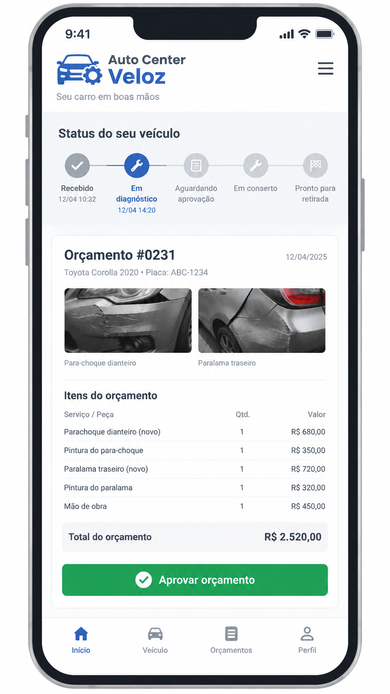
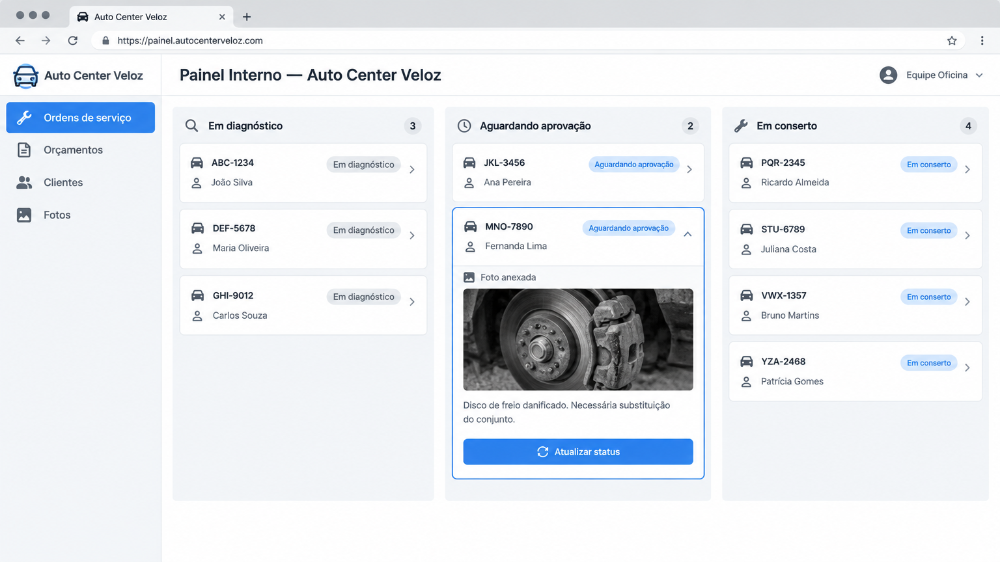

# Estudo de Caso 3: Oficina e Auto Center Veloz

## Cenário Atual

A oficina Auto Center Veloz é uma mecânica, onde os donos são o Eduardo e seu irmão Henrique. A oficina tem uma ótima reputação, tem seis mecânicos e duas recepcionistas. A recepção faz tudo manualmente, fazendo o cadastro e imprime o orçamento na hora que o cliente deixa o carro na oficina.

## Dor do cliente

Fazer tudo manualmente sempre funcionou, porém agora tem muita demanda, onde a mecânica fica muito lotada, as recepcionistas não dão conta de atender a todos. Os clientes começaram a ficar mais exigentes, perguntando quando os carros vão ficar prontos e pedindo fotos das peças com defeito.
Os mecânicos começaram a perder tempo parando o trabalho para responder a recepção, clientes demoram horas para aprovar orçamento via mensagem, e a oficina fica lotada com tantos carros.

## Informações adicionais

O Auto Center Veloz prioriza a transparência e confiança técnica, onde não querem cobrar preços altos, e querem diminuir o tempo dos carros no pátio.

## Solução

A primeira coisa que podem fazer é criar um atendimento online, onde o cliente acompanha tudo pelo celular, sem precisar ligar para a oficina. Com a ajuda de IA, o sistema responde as mensagens de maneira rápida e eficiente, liberando as recepcionistas para atender quem está no balcão.

Pelo sistema, o cliente acompanha o status do carro em tempo real (recebido, em diagnóstico, aguardando aprovação, em conserto e pronto para retirada) e recebe o orçamento digital com fotos das peças com defeito, que o mecânico anexa direto no sistema. Assim, ele aprova com um clique, sem demorar horas respondendo mensagem e o conserto começa mais rápido, diminuindo o tempo dos carros no pátio.

Os mecânicos atualizam o status direto no painel interno, sem pararem o trabalho para responder à recepção, e a informação chega ao cliente automaticamente.

Essa solução também fortalece a transparência e a confiança técnica da oficina: o cliente vê as fotos das peças, entende o que está sendo trocado e confia no preço, que continua justo.

Como reforço, fora do digital, a oficina pode contratar mais funcionários e, se o espaço continuar pequeno, aumentar os elevadores automotivos, que hoje são só cinco, diminuindo o tempo de conserto dos carros.

## Justificativa da Escolha do Formato

Escolhemos um site responsivo (web app) em vez de um aplicativo ou de um sistema interno separado. A dor principal da oficina é o cliente não conseguir acompanhar o serviço sem ligar, e o site resolve isso sem exigir que ninguém instale nada: o cliente acessa por um link, direto do celular, e a equipe usa a área restrita no computador ou tablet da recepção e da oficina.

Um app nativo seria mais caro de desenvolver e manter, e o cliente provavelmente não baixaria um aplicativo para um uso eventual. Já um sistema interno sozinho não resolveria a dor do cliente, que é justamente acompanhar o carro de fora. O site responsivo atende os dois lados com um único código, o que também combina com a prioridade da oficina de não cobrar preços altos.

## Arquitetura

A solução é um site responsivo (web app) com duas áreas:

- **Área do cliente (pública):** acesso por link, sem login complexo — o cliente acompanha o status do carro, recebe o orçamento com fotos das peças e aprova com um clique.
- **Área interna (restrita):** usada pela recepção e pelos mecânicos — cadastro de clientes, criação de orçamentos com fotos e atualização do status.

**Componentes:** front-end responsivo (HTML, CSS e JavaScript), back-end (API que gerencia clientes, ordens de serviço, orçamentos e status), banco de dados e IA de atendimento para as dúvidas mais comuns.

**Fluxo principal:** o mecânico atualiza o status no painel interno → a API grava a mudança → o cliente vê a atualização em tempo real no celular.

## Protótipos

### Tela do cliente — acompanhamento e aprovação de orçamento

### Painel interno — equipe da oficina

